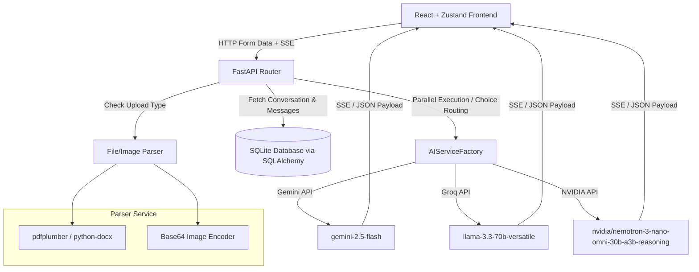

# Nova AI - Production-Grade Multimodal AI Assistant

Nova AI is a state-of-the-art, production-grade multimodal AI assistant built on a modular stack using **FastAPI (Python)** on the backend and **React + TypeScript** on the frontend. The interface features a premium dark-mode glassmorphic aesthetic built with Tailwind CSS, Framer Motion, and Lucide icons.

Powered by a unified **Multi-Provider Architecture**, the assistant supports real-time Server-Sent Events (SSE) streaming, parallel model comparison side-by-side (Gemini vs. Groq vs. NVIDIA), automated title generation, document chat (PDF, TXT, DOCX parsing), and advanced vision models for Image Understanding.

---

## 🌟 Key Features

### 🖥️ Frontend (React & TypeScript)
* **Glassmorphic UI**: Sleek, responsive layout utilizing customized CSS glassmorphic tokens, transitions, and backdrop filters.
* **Multi-Provider Selectors**: Instantly switch between Gemini, Groq, and NVIDIA in the header with static model badges.
* **Side-by-Side Model Comparison**: Toggle comparison mode to call all three providers' verified active models in parallel. Renders output text side-by-side alongside latency meters, token usage, and status tables.
* **Pulsing Thinking Indicators**: Smooth bouncing indicator dots appear during text generation to denote active model processing.
* **Speech-to-Text Integration**: Contextual audio recording capturing microphone inputs and transcribing via Groq Whisper.
* **Document Upload & Previews**: Upload PDFs, Word documents, text files, or images. Features instant thumbnails for images with options to dismiss files before sending.
* **Syntax Highlighting & Markdown**: Displays code snippet languages, syntax coloring, tables, quotes, and markdown structures cleanly.
* **Dynamic Sidebar Context**: Automatically caches histories, displays dates/titles, and allows deleting old conversations.

### ⚙️ Backend (FastAPI & SQLite)
* **Unified Provider Registry**: A modular base adapter design integrating:
  * **Gemini**: Handled via `gemini-2.5-flash` endpoint.
  * **Groq**: Handled via `llama-3.3-70b-versatile` endpoint.
  * **NVIDIA**: Handled via the reasoning model `nvidia/nemotron-3-nano-omni-30b-a3b-reasoning`.
* **Parallel Execution Engine**: Concurrently executes request mappings across all 3 active providers in asyncio pools to feed the comparison matrices.
* **Dynamic System Prompts**: Automatically replaces identity statements in system prompt templates with the active provider name dynamically.
* **Advanced Document Parsing**: Automatically extracts text using `pdfplumber` (with fallback to `PyPDF2` for complex layouts) and `python-docx` for MS Word documents.
* **Chat History Persistence**: Message histories, prompts, and session relationships are fully stored in a localized SQLite database configured with **SQLAlchemy ORM** containing tracking columns for chosen providers and models.
* **Structured Trace Logging**: Maintains application logs in `backend/logs/` detailing request payloads, database transactions, execution timings, and error stacktraces.

---

## 🏗️ Architecture Design



---

## 🚀 Quick Start Guide

### 1. Prerequisite Configuration
Create a `.env` file inside `backend/` and include your credentials:
```env
GEMINI_API_KEY="your_gemini_api_key_here"
GROQ_API_KEY="your_groq_api_key_here"
NVIDIA_API_KEY="your_nvidia_api_key_here"
```

### 2. Run the Backend API Server
First, activate the virtual environment and start FastAPI via Uvicorn:
```bash
cd backend
# Windows:
.\venv\Scripts\activate
# Unix/macOS:
source venv/bin/activate

# Apply migrations and start HTTP Server
uvicorn main:app --reload --port 8000
```
API docs will be available at [http://127.0.0.1:8000/docs](http://127.0.0.1:8000/docs).

### 3. Run the Frontend Dev Server
In a separate terminal, install node dependencies and launch Vite:
```bash
cd frontend
npm install
npm run dev
```
Open **[http://localhost:5173/](http://localhost:5173/)** in your browser to interact with the assistant!

---

## 📂 Project Structure

```text
NovaAI/
├── backend/
│   ├── app/
│   │   ├── api/          # Route routers (chat, history)
│   │   ├── core/         # Settings configuration
│   │   ├── database/     # SQLAlchemy connection session
│   │   ├── models/       # Declarative DB models (Conversation, Message)
│   │   ├── prompts/      # System prompt template files
│   │   └── services/     # Unified factory, provider classes, text extraction
│   ├── uploads/          # Temporary file directory
│   ├── alembic/          # DB migration versions
│   └── main.py           # FastAPI entry point
│
└── frontend/
    ├── src/
    │   ├── components/   # Message bubbles, inputs, sidebar elements
    │   ├── store/        # Zustand state store for SSE & API calls
    │   ├── App.tsx       # Main page layout setup
    │   └── index.css     # Dark-mode styling tokens and utilities
    └── tailwind.config.js
```
