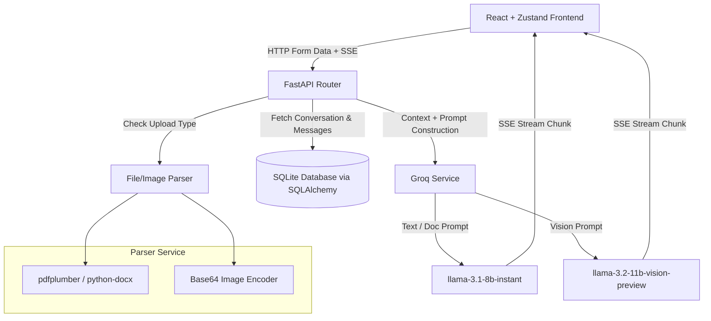

# Nova AI - Production-Grade Multimodal AI Assistant

Nova AI is a state-of-the-art, production-grade multimodal AI assistant built on a modular stack using **FastAPI (Python)** on the backend and **React + TypeScript** on the frontend. The interface features a premium dark-mode glassmorphic aesthetic built with Tailwind CSS, Framer Motion, and Lucide icons.

Powered by the **Groq Cloud API**, the assistant supports real-time Server-Sent Events (SSE) streaming, automated chat title generation, document chat (PDF, TXT, DOCX parsing), and advanced vision models for Image Understanding.

---

## 🌟 Key Features

### 🖥️ Frontend (React & TypeScript)
* **Glassmorphic UI**: Sleek, responsive layout utilizing customized CSS glassmorphic tokens, transitions, and backdrop filters.
* **Real-time SSE Streaming**: Answers are streamed token-by-token using async server-sent events for a smooth ChatGPT-like typewriter effect.
* **Document Upload & Previews**: Upload PDFs, Word documents, text files, or images. Features instant thumbnails for images with options to dismiss files before sending.
* **Syntax Highlighting & Markdown**: Displays code snippet languages, syntax coloring, tables, quotes, and markdown structures cleanly.
* **Dynamic Sidebar Sidebar Context**: Automatically caches histories, displays dates/titles, and allows deleting old conversations.

### ⚙️ Backend (FastAPI & SQLite)
* **Dual-model Prompt Router**: Automatically routes standard chats/document chats to `llama-3.1-8b-instant` and image-based multi-modal inputs to the `llama-3.2-11b-vision-preview` vision model.
* **Advanced Document Parsing**: Automatically extracts text using `pdfplumber` (with fallback to `PyPDF2` for complex layouts) and `python-docx` for MS Word documents.
* **Chat History Persistence**: Message histories, prompts, and session relationships are fully stored in a localized SQLite database configured with **SQLAlchemy ORM** and schema-managed via **Alembic**.
* **Dynamic System Prompts**: Dynamically reads tailored system instructions from templates for general conversation versus document analysis context.
* **Structured Trace Logging**: Maintains application logs in `backend/logs/` detailing request payloads, database transactions, execution timings, and error stacktraces.

---

## 🏗️ Architecture Design



---

## 🚀 Quick Start Guide

### 1. Prerequisite Configuration
Create a `.env` file inside `backend/` and include your **Groq API Key**:
```env
GROQ_API_KEY="your_groq_api_key_here"
```

### 2. Run the Backend API Server
First, activate the virtual environment and start FastAPI via Uvicorn:
```bash
cd backend
# Windows:
.\venv\Scripts\activate
# Unix/macOS:
source venv/bin/activate

# Start Server
uvicorn main:app --reload --port 8000
```
API docs will be available at [http://127.0.0.1:8000/docs](http://127.0.0.1:8000/docs).

### 3. Run the Frontend Dev Server
In a separate terminal, install node dependencies and launch Vite:
```bash
cd frontend
npm install
npm run dev
```
Open **[http://localhost:5173/](http://localhost:5173/)** in your browser to interact with the assistant!

---

## 📂 Project Structure

```text
NovaAI/
├── backend/
│   ├── app/
│   │   ├── api/          # Route routers (chat, history)
│   │   ├── core/         # Settings configuration
│   │   ├── database/     # SQLAlchemy connection session
│   │   ├── models/       # Declarative DB models (Conversation, Message)
│   │   ├── prompts/      # System prompt template files
│   │   └── services/     # Groq client wrapper, file extraction service
│   ├── uploads/          # Temporary file directory
│   ├── alembic/          # DB migration versions
│   └── main.py           # FastAPI entry point
│
└── frontend/
    ├── src/
    │   ├── components/   # Message bubbles, inputs, sidebar elements
    │   ├── store/        # Zustand state store for SSE & API calls
    │   ├── App.tsx       # Main page layout setup
    │   └── index.css     # Dark-mode styling tokens and utilities
    └── tailwind.config.js
```
